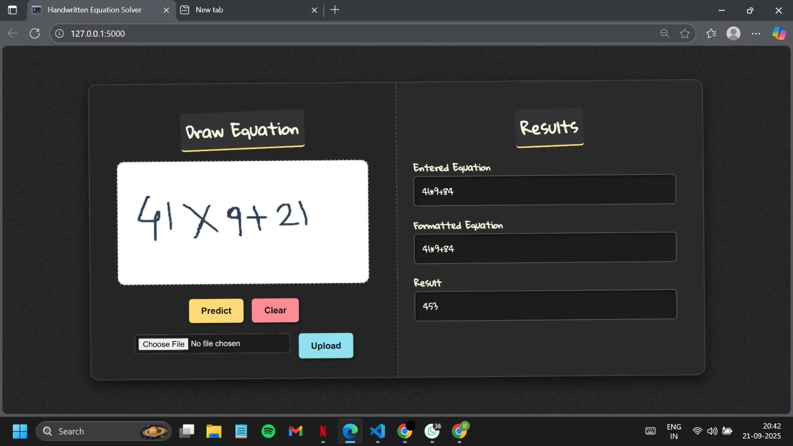

# Handwritten Equation Solver

A Python/Flask-based application that recognizes handwritten mathematical equations from a **canvas input** or **uploaded image**, reconstructs the equation, and solves it automatically.  
It combines **deep learning (TensorFlow/Keras)** with **OpenCV preprocessing** and provides a web-based interface for easy interaction.

---

## Features

- Recognizes digits `0–9` and operators: `+`, `-`, `*`, `/`, `=`.
- Supports input via:
  - Canvas drawing in the web app.
  - Image upload of handwritten equations.
- Preprocessing pipeline:
  - Grayscale conversion and thresholding.
  - Noise removal and contour detection.
  - ROI extraction, resizing, and padding.
- CNN-based recognition with confidence boosting.
- Automatic equation parsing and solving.

---
## Demo

Here’s an example of a handwritten equation drawn on the canvas:



## Technology Stack

- **Frontend**: HTML5, CSS3, JavaScript (Canvas API)  
- **Backend**: Python (Flask)  
- **Libraries**: TensorFlow/Keras, NumPy, OpenCV, SymPy  
- **Model**: Custom CNN trained on digits and operator dataset  

---

## Project Structure


## ⚡ How to Run

```bash
# Clone the repository
git clone https://github.com/<your-username>/Handwritten-Equation-Solver.git
cd Handwritten-Equation-Solver

# Create virtual environment
python -m venv venv
source venv/bin/activate   # (Windows: venv\Scripts\activate)

# Install dependencies
pip install -r requirements.txt

# Run Flask app
python app.py


